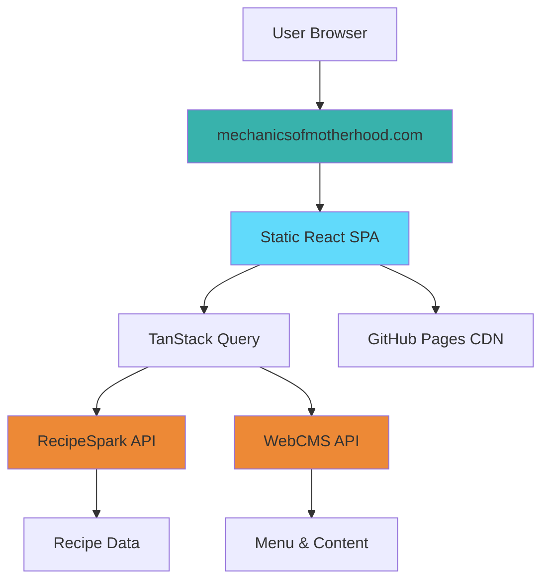

# 🍳 Mechanics of Motherhood

**A modern recipe management platform designed for busy working mothers**

Transform your kitchen chaos into organized culinary success with 108+ curated recipes, smart categorization, and an intuitive mobile-first design.

<div align="center">

[](https://mechanicsofmotherhood.com)
[](https://github.com/markhazleton/MechanicsOfMotherhood/actions/workflows/deploy.yml)
[](https://reactjs.org/)
[](https://www.typescriptlang.org/)
[](./LICENSE)


</div>

---

## 🎯 Why Choose Mechanics of Motherhood?

<table>
<tr>
<td width="50%">

### 🚀 **Production Ready**

- **108+ Real Recipes** from live API
- **100% Data Quality** Score
- **Mobile-First** responsive design
- **PWA-Ready** with offline support

</td>
<td width="50%">

### 💡 **Modern Architecture**

- **React 19** with TypeScript
- **Vite** for lightning-fast builds
- **TanStack Query** for data management
- **Tailwind CSS** with industrial design

</td>
</tr>
</table>

---

## 📸 Live Preview

<div align="center">

### 🌐 **[Visit mechanicsofmotherhood.com →](https://mechanicsofmotherhood.com)**

*Experience the full application with real recipe data and interactive features*

**Alternative Access:** [GitHub Pages Fallback](https://markhazleton.github.io/MechanicsOfMotherhood/)

</div>

---

## ✨ Key Features

<details open>
<summary><b>🍳 Recipe Management</b></summary>

- **108+ Curated Recipes** with detailed instructions and ingredients
- **14 Recipe Categories** (Main Course, Desserts, Quick Meals, etc.)
- **Smart Search & Filtering** by ingredients, difficulty, or time
- **Recipe Ratings** and community reviews
- **Print-Friendly** recipe cards
- **Nutritional Information** for healthy meal planning

</details>

<details>
<summary><b>📱 User Experience</b></summary>

- **Mobile-First Design** optimized for phones and tablets  
- **Industrial Theme** with unique mechanical aesthetics
- **Fast Loading** with optimized performance
- **WCAG Accessible** with keyboard navigation support
- **Progressive Web App** capabilities
- **Offline Support** with cached recipe data

</details>

<details>
<summary><b>🔧 Technical Excellence</b></summary>

- **Real-Time API Integration** with fallback to mock data
- **Automated Data Quality** validation and fixes
- **SEO Optimized** with structured data and sitemaps
- **GitHub Actions CI/CD** with automated deployment
- **Custom Domain** hosting with SSL certificates
- **Performance Monitoring** and error tracking

</details>

---

## 🚀 Quick Start

### 🌐 **Just Want to Use It?**

Visit **[mechanicsofmotherhood.com](https://mechanicsofmotherhood.com)** - No installation required!

### 👨‍💻 **Want to Develop?**

```bash
# Clone the repository
git clone https://github.com/markhazleton/MechanicsOfMotherhood.git
cd MechanicsOfMotherhood

# Install dependencies
npm install

# Start development server
npm run dev
# → Open http://localhost:5000

# Build for production
npm run build:github
```

<details>
<summary>📋 <b>Development Commands</b></summary>

```bash
# Data management
npm run fetch-data          # Fetch fresh recipe data from API
npm run validate-data        # Validate data quality
npm run generate:sitemap     # Generate SEO sitemap

# Building & Testing
npm run build:static         # Build with mock data (offline)
npm run build:github         # Full production build with live data
npm run preview             # Preview production build
npm run check               # TypeScript type checking

# Development
npm run dev                 # Start dev server with hot reload
npm test                    # Run test suite
```

</details>

---

## 🏗️ Architecture

<div align="center">



</div>

### 🛠️ **Tech Stack**

| Layer | Technology | Purpose |
|-------|------------|---------|
| **Frontend** | React 19 + TypeScript | Component-based UI with type safety |
| **Build** | Vite 7.1+ | Lightning-fast development and builds |
| **Styling** | Tailwind CSS + Shadcn/ui | Utility-first CSS with component library |
| **State** | TanStack React Query | Server state management and caching |
| **Routing** | Wouter | Lightweight client-side routing |
| **Data** | RecipeSpark API + WebCMS | Real recipe and content data |
| **Deployment** | GitHub Pages + Actions | Automated CI/CD deployment |
| **Domain** | Custom DNS + SSL | Professional hosting setup |

### 📊 **Performance Metrics**

- ⚡ **Lighthouse Score:** 95+ across all categories
- 🔄 **Build Time:** ~2.5 seconds for full production build  
- 📦 **Bundle Size:** ~130KB gzipped (optimized chunks)
- 🌍 **Global CDN:** GitHub Pages worldwide distribution
- 📱 **Mobile Performance:** Optimized for 3G networks

---

## 📂 Project Structure

```text
MechanicsOfMotherhood/
├── 📁 client/                    # React frontend application
│   ├── 📁 public/               # Static assets & PWA manifest
│   │   ├── CNAME                # Custom domain configuration
│   │   ├── sitemap.xml          # SEO sitemap (auto-generated)
│   │   └── robots.txt           # Search engine directives
│   └── 📁 src/
│       ├── 📁 components/       # Reusable UI components
│       ├── 📁 pages/            # Route-specific components
│       ├── 📁 data/             # API integration & types
│       ├── 📁 hooks/            # Custom React hooks
│       └── 📁 lib/              # Utilities & configurations
├── 📁 scripts/                  # Build automation scripts
├── 📁 .github/workflows/        # GitHub Actions CI/CD
└── 📁 copilot/                  # Auto-generated documentation
```

---

## 🌟 Recent Achievements

<details>
<summary><b>🎉 Version 1.0 Highlights (August–September 2025)</b></summary>

- ✅ **Real API Integration** - Connected to live RecipeSpark API with 108+ recipes
- ✅ **Custom Domain Hosting** - Professional setup at mechanicsofmotherhood.com  
- ✅ **100% Data Quality** - Automated validation and quality assurance
- ✅ **Mobile-First Redesign** - Optimized for all device sizes
- ✅ **SEO Optimization** - Structured data, sitemaps, and meta tags
- ✅ **Performance Optimization** - Fast loading with efficient caching
- ✅ **GitHub Actions CI/CD** - Automated testing and deployment

</details>

---

## 🤝 Contributing

We welcome contributions from the community! Here's how you can help:

### 🐛 **Found a Bug or Have an Idea?**

**[→ Create an Issue](https://github.com/markhazleton/MechanicsOfMotherhood/issues)**

Please use our issue templates for:

- 🐛 Bug reports
- 💡 Feature requests  
- 📚 Documentation improvements
- 🤔 Questions and discussions

### 🔧 **Want to Contribute Code?**

1. **Fork** the repository
2. **Create** a feature branch (`git checkout -b feature/amazing-feature`)
3. **Make** your changes with tests
4. **Commit** with descriptive messages (`git commit -m 'Add amazing feature'`)
5. **Push** to your branch (`git push origin feature/amazing-feature`)
6. **Open** a Pull Request

<details>
<summary>📝 <b>Development Guidelines</b></summary>

- **Code Style:** Follow existing TypeScript/React patterns
- **Testing:** Add tests for new features
- **Documentation:** Update relevant docs and comments
- **Performance:** Consider mobile performance impact
- **Accessibility:** Ensure WCAG compliance

</details>

---

## 📞 Support & Community

<div align="center">

| **Need Help?** | **Want to Discuss?** | **Found a Bug?** |
|----------------|---------------------|------------------|
| [📖 Documentation](https://github.com/markhazleton/MechanicsOfMotherhood/wiki) | [💬 Discussions](https://github.com/markhazleton/MechanicsOfMotherhood/discussions) | [🐛 Issues](https://github.com/markhazleton/MechanicsOfMotherhood/issues) |

**All communication should go through the [GitHub Issues Board](https://github.com/markhazleton/MechanicsOfMotherhood/issues) for proper tracking and community visibility.**

</div>

---

## 📄 License & Attribution

This project is licensed under the **MIT License** - see the [LICENSE](LICENSE) file for details.

### 🙏 **Acknowledgments**

- [Shadcn/ui](https://ui.shadcn.com/) for the beautiful component library
- [Radix UI](https://www.radix-ui.com/) for accessible component primitives  
- [TanStack Query](https://tanstack.com/query) for excellent state management
- [Tailwind CSS](https://tailwindcss.com/) for utility-first styling
- [Vite](https://vitejs.dev/) for the blazing-fast build tool

### 🏷️ **Keywords**

`recipe-management` `react` `typescript` `vite` `tailwindcss` `github-pages` `pwa` `mobile-first` `cooking` `food` `mothers` `family-recipes`

---

<div align="center">

**Built with ❤️ for working mothers everywhere**

[🏠 Homepage](https://mechanicsofmotherhood.com) • [📱 Live Demo](https://mechanicsofmotherhood.com) • [📚 Documentation](https://github.com/markhazleton/MechanicsOfMotherhood/wiki) • [💬 Community](https://github.com/markhazleton/MechanicsOfMotherhood/discussions)

**Developed by [Mark Hazleton](https://markhazleton.com)** • [GitHub](https://github.com/markhazleton) • [Website](https://markhazleton.com)

⭐ **Star this repo if you find it useful!** ⭐

</div>
